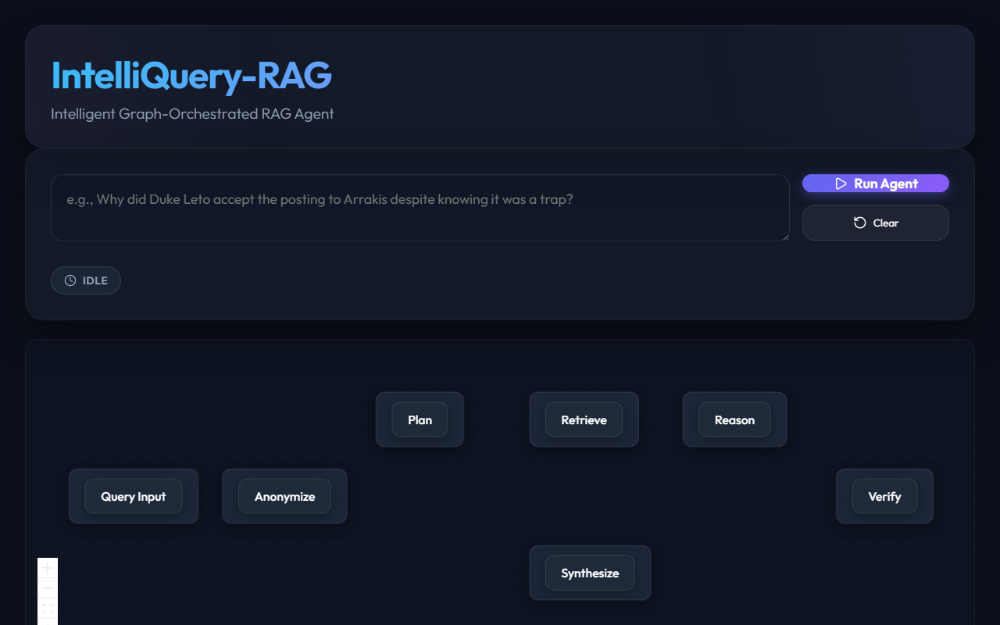

<div align="center">

<!-- Hero Banner -->


<br />
<br />

# 🧠 IntelliQuery-RAG

### *Your documents. Your questions. Real answers.*

<br />

[](https://github.com/Jay14090/IntelliQuery-RAG/actions/workflows/ci.yml)
[](https://www.python.org/)
[](https://github.com/langchain-ai/langgraph)
[](https://github.com/facebookresearch/faiss)
[](https://react.dev)
[](https://fastapi.tiangolo.com)
[](LICENSE)

<br />

[🚀 Quick Start](#-quick-start) · [✨ Features](#-what-makes-this-different) · [🏗️ Architecture](#%EF%B8%8F-how-it-works-under-the-hood) · [📖 Usage](#-usage) · [🧪 Testing](#-testing)

</div>

---

<br />

## 💬 What Is This?

Imagine you have a 400-page PDF — a textbook, a novel, a legal contract — and you want to ask it a question. Not a simple *"What is X?"* question, but something complex:

> *"Why did Duke Leto accept the posting to Arrakis despite knowing it was a trap?"*

That kind of question needs **reasoning**. It needs the system to find the right passages, connect them, think step-by-step, and give you an answer that's actually grounded in your document — not hallucinated.

**IntelliQuery-RAG** does exactly that.

It's an AI agent that **reads your documents, plans how to answer your question, retrieves the right information, reasons through it, and verifies its own answer** — all automatically, all visible to you through a live graph visualization.

Think of it as giving ChatGPT a research assistant's brain and a fact-checker's discipline.

<br />

---

<br />

## 🛠️ Tech Stack

<div align="center">

| Layer | Technology | Why |
|:---:|:---:|:---|
| 🧠 **Agent Brain** | [LangGraph](https://github.com/langchain-ai/langgraph) | Deterministic state machine — every reasoning step is traceable |
| 🔗 **LLM Framework** | [LangChain](https://github.com/langchain-ai/langchain) | Structured output, prompt templates, provider abstraction |
| 🗄️ **Vector Search** | [FAISS](https://github.com/facebookresearch/faiss) | Blazing-fast similarity search across three separate indexes |
| 🤖 **Default LLM** | [GPT-4o](https://openai.com/index/gpt-4o/) | Swappable — Groq, Anthropic supported via config |
| 📊 **Evaluation** | [Ragas](https://github.com/explodinggradients/ragas) | Industry-standard RAG metrics (faithfulness, relevancy, recall) |
| ⚡ **Backend API** | [FastAPI](https://fastapi.tiangolo.com) | Async REST + SSE streaming for real-time graph updates |
| 🎨 **Frontend** | [React](https://react.dev) + [React Flow](https://reactflow.dev) | Live graph visualization with animated node transitions |
| 🐳 **Deployment** | [Docker](https://www.docker.com/) | One-command setup with `docker-compose` |

</div>

<br />

---

<br />

## ✨ What Makes This Different?

Most RAG systems do this:

```
Question → Search documents → Paste into LLM → Hope for the best
```

IntelliQuery does this:

```
Question → Strip names to prevent bias → Plan sub-tasks → Resolve entities
    → For each task: Retrieve → Filter noise → Reason → Verify grounding
        → Loop until done → Synthesize final answer
```

Here's what's actually unique:

<br />

### 🔒 Anonymization-First Planning

Before the LLM plans *how* to answer, we **strip all named entities** from the question. Why? Because if you ask about "Paul Atreides", GPT already knows who that is from training data. By anonymizing to `PERSON_1`, the planner creates a strategy based purely on *structure* — not pre-trained knowledge. Entities are re-injected only when it's time to actually search.

### 🧠 Triple-Index Retrieval

Instead of one big vector store, we maintain **three parallel FAISS indexes**:
- **📄 Text Chunks** — raw document passages
- **📑 Chapter Summaries** — LLM-generated section overviews  
- **💬 Key Quotes** — extracted significant quotes

All three are queried simultaneously and merged, giving the agent both fine-grained detail and high-level context.

### 🔍 Self-Verification (Self-RAG)

After every reasoning step, the system **audits its own answer** against the source documents. Any claim that can't be traced back to retrieved text is flagged as unsupported. Inspired by [Self-RAG (Asai et al., 2023)](https://arxiv.org/abs/2310.11511).

### 📋 Plan-and-Solve Decomposition

Complex questions are broken into atomic `RETRIEVE` and `REASON` tasks, executed sequentially with adaptive re-planning. Based on [Plan-and-Solve Prompting (Wang et al., 2023)](https://arxiv.org/abs/2305.04091).

### 🧹 Context Distillation

Raw retrieved text goes through an LLM filter that strips irrelevant noise *before* reasoning. This dramatically reduces hallucination by keeping the reasoning context clean and focused.

### 🛡️ Chain-of-Thought Guardrails

The reasoning prompt includes both ✅ positive (sufficient context) and ❌ negative (insufficient context) few-shot examples — teaching the model *when to say "I don't know"* instead of fabricating an answer.

<br />

---

<br />

## 🏗️ How It Works Under the Hood

```mermaid
graph LR
    A["🔒 Anonymize Query"] --> B["📋 Generate Plan"]
    B --> C["🔓 Resolve Entities"]
    C --> D["🔀 Route Task"]
    D -->|RETRIEVE| E["📚 Retrieve Docs"]
    D -->|REASON| G["🧠 Reason & Answer"]
    E --> F["🧹 Distill Context"]
    F --> G
    G --> H["🔍 Verify Grounding"]
    H --> I["🔄 Advance / Replan"]
    I -->|More tasks| D
    I -->|Done| J["✨ Synthesize Response"]
    D -->|All complete| J

    style A fill:#1e293b,stroke:#a78bfa,color:#e2e8f0
    style B fill:#1e293b,stroke:#a78bfa,color:#e2e8f0
    style C fill:#1e293b,stroke:#a78bfa,color:#e2e8f0
    style D fill:#172554,stroke:#3b82f6,color:#93c5fd
    style E fill:#1e293b,stroke:#38bdf8,color:#e2e8f0
    style F fill:#1e293b,stroke:#38bdf8,color:#e2e8f0
    style G fill:#1e293b,stroke:#f472b6,color:#e2e8f0
    style H fill:#1e293b,stroke:#fb923c,color:#e2e8f0
    style I fill:#172554,stroke:#3b82f6,color:#93c5fd
    style J fill:#052e16,stroke:#22c55e,color:#4ade80
```



**Every node is a standalone, testable function.** The graph is deterministic — no black-box prompt chaining. You can trace exactly why the agent made every decision.

<br />

---

<br />

## 🔬 Example: Dune Analysis

The system is demonstrated on Frank Herbert's *Dune* — intentionally chosen because GPT *already knows about Dune*, letting us verify the agent uses **retrieved evidence** rather than pre-trained knowledge.

<table>
<tr>
<td width="50%">

**Question:**
> *"Why did Duke Leto accept the posting to Arrakis despite knowing it was a trap?"*

</td>
<td width="50%">

**What the agent does:**

| Step | Action |
|:---:|:---|
| 🔒 | Anonymize → *"Why did PERSON_1 accept the posting to LOCATION_1…"* |
| 📋 | Plan → `[RETRIEVE: Identify PERSON_1]` → `[RETRIEVE: LOCATION_1 posting context]` → `[REASON: Deduce motivations]` |
| 🔓 | Resolve → `PERSON_1 → Duke Leto`, `LOCATION_1 → Arrakis` |
| 📚 | Retrieve chunks + summaries + quotes for each sub-task |
| 🧹 | Filter irrelevant text |
| 🧠 | Chain-of-thought reasoning |
| 🔍 | Verify every claim is grounded |
| ✨ | Synthesize final answer with full trace |

</td>
</tr>
</table>

<br />

---

<br />

## 🚀 Quick Start

### Prerequisites

- **Python 3.9+**
- An **OpenAI API key** (or Groq / Anthropic — [see provider config](#-configuration))

### 1. Clone & Install

```bash
git clone https://github.com/Jay14090/IntelliQuery-RAG.git
cd IntelliQuery-RAG

# Create virtual environment
python -m venv .venv
source .venv/bin/activate      # Windows: .venv\Scripts\activate

# Install with dev dependencies
pip install -e ".[dev]"
```

### 2. Configure

```bash
cp .env.example .env
```

Edit `.env` and add your API key:
```env
OPENAI_API_KEY=sk-your-key-here
```

### 3. Build Vector Stores (First Time Only)

```bash
jupyter notebook notebooks/intelliquery_tutorial.ipynb
```

This loads your PDF, splits it into sections, generates summaries, and builds three FAISS indexes.

### 4. Run

<table>
<tr>
<td>

**🎨 React Frontend + FastAPI**
```bash
# Terminal 1: Backend
python -m ui.api

# Terminal 2: Frontend
cd frontend && npm install && npm run dev
```
Open `http://localhost:5173`

</td>
<td>

**🐳 Docker (One Command)**
```bash
docker-compose up --build
```
Open `http://localhost:7860`

</td>
</tr>
</table>

<br />

---

<br />

## 📖 Usage

### Programmatic API

```python
from intelliquery.config import load_settings
from intelliquery.agents import build_agent_graph

settings = load_settings()
agent = build_agent_graph(settings)

result = agent.invoke({
    "query": "How did Paul prove himself to the Fremen?"
})

print(result["final_response"])
print(result["reasoning_trace"])
```

### REST API

```bash
# Health check
curl http://localhost:8000/api/health

# Query (POST)
curl -X POST http://localhost:8000/api/query \
  -H "Content-Type: application/json" \
  -d '{"query": "What role does the spice melange play in the economy of Arrakis?"}'

# Streaming (SSE) — watch the agent think in real time
curl "http://localhost:8000/api/query/stream?query=Who+are+the+Fremen"
```

### Evaluation

```python
from intelliquery.evaluation.metrics import evaluate_response

result = evaluate_response(
    question="Who is Paul Atreides?",
    generated_answer="Paul is the son of Duke Leto...",
    ground_truth="Paul Atreides is the heir of House Atreides...",
    contexts=["Paul, son of the Duke, arrived on Arrakis..."]
)
print(result.summary())
#   Answer Correctness: 0.872
#   Faithfulness: 0.950
#   Answer Relevancy: 0.915
#   Context Recall: 0.800
#   Answer Similarity: 0.890
```

<br />

---

<br />

## ⚙️ Configuration

All settings live in `config.yaml` — zero code changes needed:

```yaml
llm:
  provider: "openai"             # openai | groq | anthropic
  model_name: "gpt-4o"
  temperature: 0.0

embeddings:
  model_name: "text-embedding-3-small"

retriever:
  chunk_top_k: 2                 # Text chunks per query
  summary_top_k: 2               # Chapter summaries per query
  quotes_top_k: 8                # Quotes per query

agent:
  max_iterations: 10             # Safety cap on planning loops
  enable_verification: true      # Toggle hallucination checking
```

To use **Groq** instead of OpenAI:
```bash
pip install -e ".[groq]"
```
```yaml
llm:
  provider: "groq"
  model_name: "llama-3.1-70b-versatile"
```

<br />

---

<br />

## 📁 Project Structure

```
IntelliQuery-RAG/
│
├── 🧠 intelliquery/               Core Python package
│   ├── agents/                     LangGraph state-graph & node definitions
│   │   ├── graph.py                Graph wiring & compilation
│   │   ├── nodes.py                10 standalone node functions
│   │   └── state.py                TypedDict state schema
│   ├── chains/                     LLM chain compositions
│   │   ├── anonymizer.py           Entity anonymization
│   │   ├── distiller.py            Context noise filtering
│   │   ├── planner.py              Task decomposition
│   │   ├── reasoner.py             Chain-of-thought reasoning
│   │   └── verifier.py             Grounding verification
│   ├── evaluation/                 Ragas-based quality metrics
│   ├── processing/                 PDF loading, text cleaning, summarization
│   ├── prompts/                    Versioned prompt templates
│   ├── providers/                  Abstract LLM provider interface
│   └── retrievers/                 FAISS multi-index retrieval
│
├── 🎨 frontend/                    React + Vite + React Flow UI
├── 🖥️ ui/                          Gradio fallback UI + FastAPI backend
├── 🧪 tests/                       pytest test suite
├── 📓 notebooks/                   Tutorial & ingestion notebook
├── 📦 data/                        Vector store indexes (git-ignored)
├── ⚙️ config.yaml                  Default configuration
├── 🐳 Dockerfile + docker-compose  Container deployment
└── 📄 pyproject.toml               Python packaging & tooling
```

<br />

---

<br />

## 🧪 Testing

```bash
# Run all tests
pytest tests/ -v

# With coverage report
pytest tests/ -v --cov=intelliquery --cov-report=html

# Lint check
ruff check intelliquery/ ui/ tests/
```

CI runs automatically on every push via [GitHub Actions](.github/workflows/ci.yml) across Python 3.10, 3.11, and 3.12.

<br />

---

<br />

## 🧩 Key Design Decisions

| Decision | Rationale |
|:---|:---|
| **Deterministic graph, not autonomous agent** | Full traceability — you can debug *why* the agent did something |
| **Anonymize before planning** | Prevents LLM from leaking training-data knowledge into the retrieval plan |
| **Three separate vector indexes** | Different granularities (chunks, summaries, quotes) catch different types of evidence |
| **Verify after every reasoning step** | Catches hallucinations *during* reasoning, not just at the end |
| **Structured output everywhere** | Pydantic models for every chain → no fragile regex parsing |
| **Provider abstraction** | Swap LLMs via config — no code changes, no vendor lock-in |

<br />

---

<br />

## 🗺️ Roadmap

- [ ] 🔄 Streaming UI — watch each node light up in real-time on the React frontend
- [ ] 📚 Multi-document support — ingest and query across multiple PDFs
- [ ] 🌐 Web source integration — combine document retrieval with live web search
- [ ] 🧮 Hybrid retrieval — BM25 + dense vectors for better recall
- [ ] 📊 Dashboard — built-in Ragas evaluation dashboard
- [ ] 🔌 Plugin system — custom nodes for domain-specific logic

<br />

---

<br />

## 🤝 Contributing

Contributions are welcome! Here's how:

1. **Fork** the repository
2. **Create** a feature branch → `git checkout -b feature/amazing-thing`
3. **Commit** your changes → `git commit -m 'Add amazing thing'`
4. **Push** → `git push origin feature/amazing-thing`
5. **Open** a Pull Request

<br />

---

<br />

## 📄 License

Licensed under the [Apache License 2.0](LICENSE). Use it, modify it, build on it.

<br />

---

<div align="center">

<br />

**Built with 🧠 + ☕ by [Jay14090](https://github.com/Jay14090)**

*If this helped you, consider giving it a ⭐*

<br />

</div>
