# IntelliQuery-RAG 🧠⚡

> **Intelligent Graph-Orchestrated RAG Agent** — a production-grade system for complex, multi-step question answering over document corpora.

[](https://github.com/jay14/IntelliQuery-RAG/actions/workflows/ci.yml)
[](https://www.python.org/)
[](LICENSE)

---

## 💡 The Problem

Standard RAG pipelines retrieve documents via semantic similarity and feed them directly to an LLM. This works for simple factual lookups but **breaks down** on questions requiring:

- **Multi-hop reasoning** — connecting facts across different parts of a corpus
- **Entity resolution** — understanding who or what the question refers to
- **Strategic planning** — decomposing a complex question into ordered sub-tasks
- **Grounding verification** — ensuring the answer doesn't hallucinate beyond the source material

## 🚀 The Solution

IntelliQuery-RAG replaces the naive "retrieve → generate" pattern with a **deterministic state-graph** that acts as the reasoning brain of an autonomous agent. The graph orchestrates a multi-step pipeline:

```
Query → Anonymise → Plan → Resolve Entities → [Retrieve ↔ Distill ↔ Reason ↔ Verify] × N → Synthesise
```

Each step is a distinct, controllable node in a LangGraph state machine — giving you full visibility and control over the reasoning process.

---

## 🏗️ Architecture

```mermaid
graph LR
    A["🔒 Anonymise Query"] --> B["📋 Generate Plan"]
    B --> C["🔓 Resolve Entities"]
    C --> D["🔀 Route Task"]
    D -->|RETRIEVE| E["📚 Retrieve Docs"]
    D -->|REASON| G["🧠 Reason & Answer"]
    E --> F["🧹 Distill Context"]
    F --> G
    G --> H["🔍 Verify Grounding"]
    H --> I["🔄 Advance / Replan"]
    I -->|More tasks| D
    I -->|Done| J["✨ Synthesise Response"]
    D -->|All complete| J

    style A fill:#1e293b,stroke:#475569,color:#e2e8f0
    style B fill:#1e293b,stroke:#475569,color:#e2e8f0
    style C fill:#1e293b,stroke:#475569,color:#e2e8f0
    style D fill:#172554,stroke:#3b82f6,color:#93c5fd
    style E fill:#1e293b,stroke:#475569,color:#e2e8f0
    style F fill:#1e293b,stroke:#475569,color:#e2e8f0
    style G fill:#1e293b,stroke:#475569,color:#e2e8f0
    style H fill:#1e293b,stroke:#475569,color:#e2e8f0
    style I fill:#172554,stroke:#3b82f6,color:#93c5fd
    style J fill:#052e16,stroke:#22c55e,color:#4ade80
```



---

## 🌟 Key Features

| Feature | Description |
|---|---|
| **Deterministic State-Graph** | LangGraph-powered pipeline — every step is traceable and debuggable |
| **Multi-Step Planning** | Breaks complex questions into atomic RETRIEVE / REASON sub-tasks |
| **Entity Anonymisation** | Strips named entities before planning to prevent LLM bias |
| **Context Distillation** | Filters retrieved documents to only query-relevant content |
| **Chain-of-Thought Reasoning** | Step-by-step reasoning with positive and negative few-shot examples |
| **Grounding Verification** | Self-RAG–inspired check flags unsupported claims |
| **Adaptive Re-planning** | Updates the plan as new evidence is discovered |
| **Provider Abstraction** | Swap LLM providers (OpenAI, Groq, Anthropic) via config — no code changes |
| **Ragas Evaluation** | Built-in quality metrics: correctness, faithfulness, relevancy, recall, similarity |

---

## 🔍 Use Case: Dune Analysis

The system is demonstrated on Frank Herbert's *Dune* — chosen because it allows us to monitor whether the model relies on **retrieved evidence** vs. **pre-trained knowledge**.

**Example question:**

> *"Why did the Duke accept the posting to Arrakis despite knowing it was a trap?"*

The agent's execution:
1. **Anonymise** → "Why did PERSON_1 accept the posting to LOCATION_1 despite knowing it was a trap?"
2. **Plan** → [RETRIEVE: Identify PERSON_1] → [RETRIEVE: Context about LOCATION_1 posting] → [REASON: Deduce motivations]
3. **Resolve** → Replace PERSON_1 → Duke Leto, LOCATION_1 → Arrakis
4. **Execute** → Retrieve chunks, distill, reason, verify grounding
5. **Synthesise** → Final grounded answer with full reasoning trace

---

## 📦 Installation

### Prerequisites
- Python 3.9+
- An OpenAI API key (or another supported provider)

### Quick Start

```bash
# Clone the repository
git clone https://github.com/jay14/IntelliQuery-RAG.git
cd IntelliQuery-RAG

# Create virtual environment
python -m venv .venv
source .venv/bin/activate  # Windows: .venv\Scripts\activate

# Install dependencies
pip install -e ".[dev]"

# Set up your API key
cp .env.example .env
# Edit .env and add your OPENAI_API_KEY
```

### Docker

```bash
# Build and run
docker-compose up --build

# Open the UI at http://localhost:7860
```

---

## 🖥️ Usage

### 1. Build Vector Stores (First Time)

Open and run the tutorial notebook:
```bash
jupyter notebook notebooks/intelliquery_tutorial.ipynb
```

This will:
- Load your Dune PDF
- Split it into sections
- Generate chapter summaries
- Build three FAISS indexes (chunks, summaries, quotes)

### 2. Launch the Gradio UI

```bash
python -m ui.app
```

Open `http://localhost:7860` in your browser.

### 3. Programmatic Usage

```python
from intelliquery.config import load_settings
from intelliquery.agents import build_agent_graph

settings = load_settings()
agent = build_agent_graph(settings)

result = agent.invoke({
    "query": "How did Paul prove himself to the Fremen?"
})

print(result["final_response"])
print(result["reasoning_trace"])
```

---

## 🛠️ Configuration

All non-secret settings are in `config.yaml`:

```yaml
llm:
  provider: "openai"
  model_name: "gpt-4o"
  temperature: 0.0

retriever:
  chunk_top_k: 2
  summary_top_k: 2
  quotes_top_k: 8

agent:
  max_iterations: 10
  enable_verification: true
```

API keys go in `.env`:
```
OPENAI_API_KEY=sk-...
```

---

## 📁 Project Structure

```
IntelliQuery-RAG/
├── intelliquery/           # Core Python package
│   ├── agents/             # LangGraph state-graph and node definitions
│   ├── chains/             # LLM chain compositions
│   ├── evaluation/         # Ragas-based quality metrics
│   ├── processing/         # PDF loading, text cleaning, summarisation
│   ├── prompts/            # Versioned prompt templates
│   ├── providers/          # Abstract LLM provider interface
│   ├── retrievers/         # FAISS-backed document retrieval
│   └── config.py           # Configuration loader
├── ui/                     # Gradio front-end
├── tests/                  # pytest test suite
├── notebooks/              # Tutorial notebook
├── data/                   # Vector store indexes (git-ignored)
├── config.yaml             # Default configuration
├── pyproject.toml          # Python packaging
├── Dockerfile
└── docker-compose.yml
```

---

## 🧪 Testing

```bash
# Run all tests
pytest tests/ -v

# With coverage
pytest tests/ -v --cov=intelliquery --cov-report=html
```

---

## 💡 Technical Approach

1. **Triple-index retrieval** — text chunks, LLM-generated section summaries, and extracted quotes are each encoded into separate FAISS stores, then merged during retrieval for comprehensive context.

2. **Anonymisation-first planning** — the question is anonymised before planning to prevent the LLM from leaking pre-trained knowledge about specific entities into the plan structure.

3. **Atomic task decomposition** — each plan step is classified as either RETRIEVE (search the corpus) or REASON (deduce from accumulated evidence), executed by specialised graph nodes.

4. **Context distillation** — raw retrieved text is filtered by an LLM to remove noise before reasoning, reducing hallucination risk.

5. **Chain-of-Thought with guardrails** — the reasoning prompt includes both positive (sufficient context) and negative (insufficient context) few-shot examples, teaching the model when to say "I don't know."

6. **Self-RAG–style verification** — every generated answer is audited against the source context, with unsupported claims flagged. Inspired by [Self-RAG (Asai et al., 2023)](https://arxiv.org/abs/2310.11511).

7. **Plan-and-Solve reasoning** — the iterative plan/execute/replan loop draws from [Plan-and-Solve Prompting (Wang et al., 2023)](https://arxiv.org/abs/2305.04091).

---

## 🤝 Contributing

Contributions are welcome! Please:

1. Fork the repository
2. Create a feature branch (`git checkout -b feature/amazing-thing`)
3. Commit your changes (`git commit -m 'Add amazing thing'`)
4. Push to the branch (`git push origin feature/amazing-thing`)
5. Open a Pull Request

---

## 📄 License

This project is licensed under the Apache License 2.0 — see [LICENSE](LICENSE) for details.

---

<p align="center">
  Built with 🧠 by <a href="https://github.com/jay14">jay14</a>
</p>
